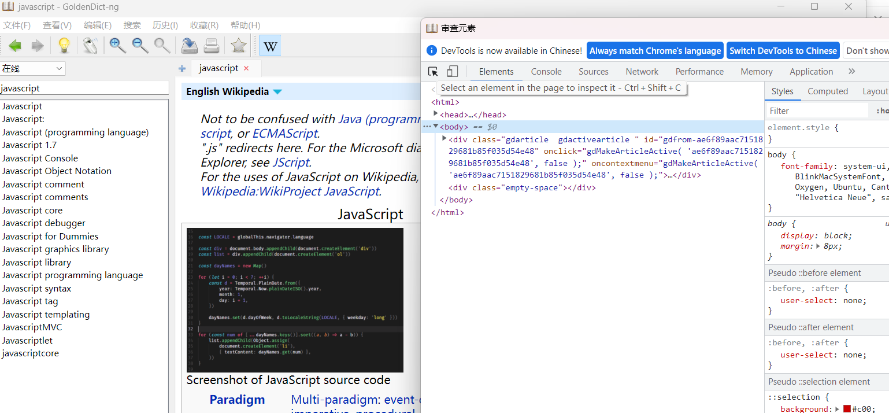
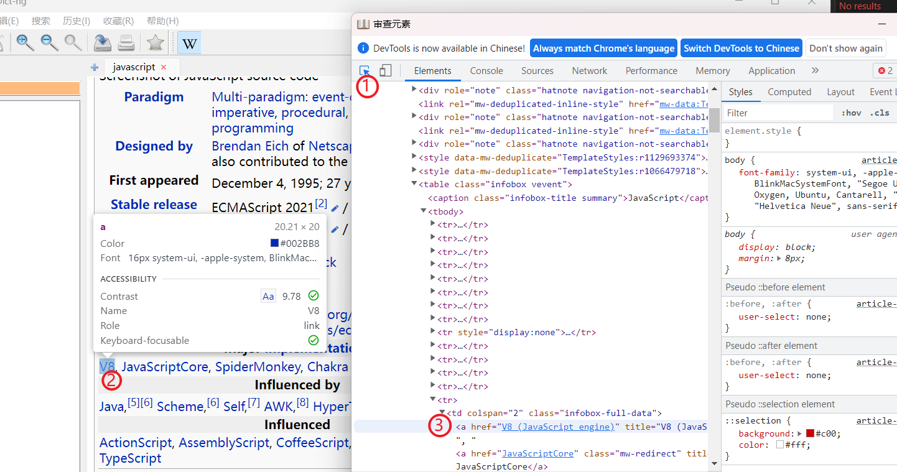
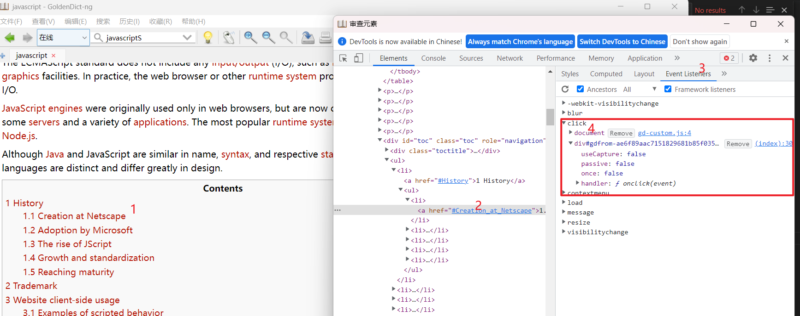
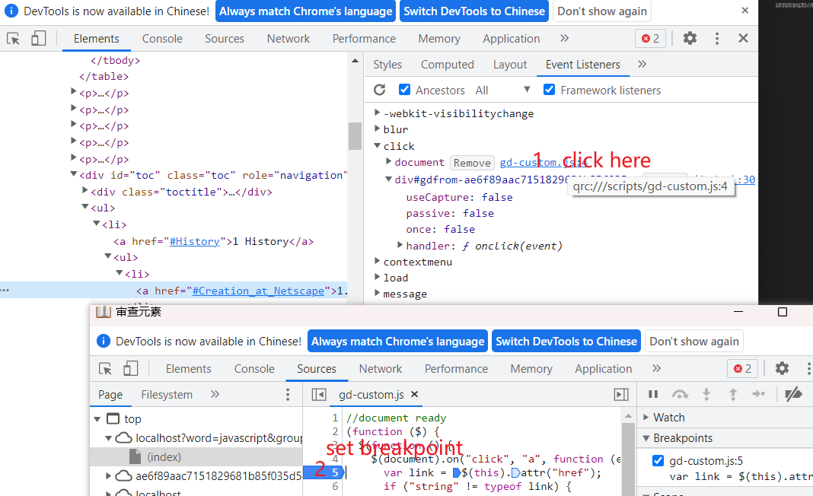
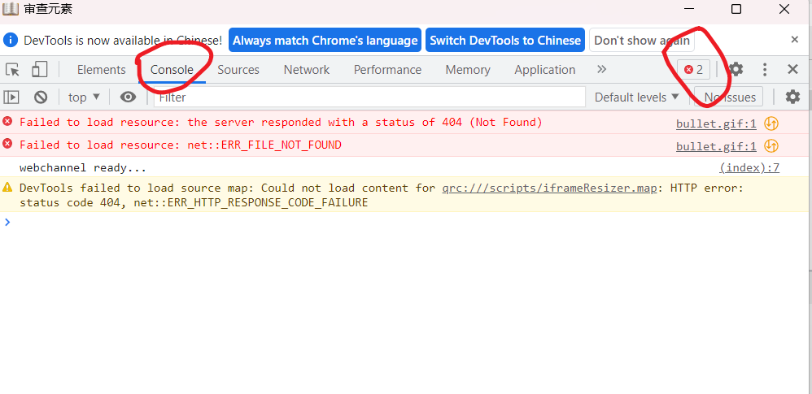

# background
When some js functions do not work as expected, this article tries to give a debug solution to pinpoint the problem.

# goldendict-ng inspector

Goldendict-ng has embedded an inspector, you can trigger it manually using `F12`.

Screenshot:

# How to navigate to the specified element

Click the find element and move mouse to the specified element, click the element will navigate the source panel to the very place.

# Modify the css style

you can play around with the css to modify the appearance of the html and check the results.

# check javascript events

- navigate to the specified element
- check eventlisterner panel
- pay attention to the click events
- in the following screenshot ,there are two registered event listeners, one from the goldendict `gd-custom.js` and one from the html itself.
- click the above event listener location will locate to the right place in the javascript.

If some desired event does not triggered , it can first check does the event listeners has been successfully registered. then set a breakpoint in the right place to check whether the event has been triggered and if it can executed successfully.

# reproduce the issue in the goldendit

following your normal operations and debugging the javascript code and pay attention to the console output. Whether any errors happened.
