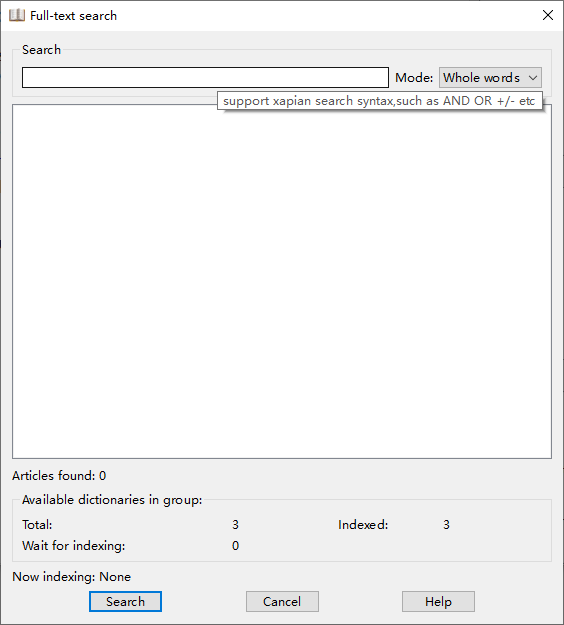

The full-text search dialog can be opened via menu "Search" or "Ctrl+Shift+F".

Full-text search allow to search words or sentences not in dictionary headwords but in articles text of dictionaries from current dictionaries group.

!!! note
    The dictionary will index for full-text search in background and started immediately after program start, name of the currently indexing dictionary is displayed in the status line. This process can take a long time and require many computing resources.You may turn off indexing for huge dictionaries like Wikipedias or Wiktionaries in preferences. To find dictionary which can't be indexed check GoldenDict with `--log-to-file` or check `stdout`.

{ width="450" }

Type the desired word in "Search line" to search.

Search modes

* "Whole words" - This follow the xapian search syntax . check   [query syntax](https://xapian.org/docs/queryparser.html).
* "Plain text" - mode like "Whole words" but every word in search line can be treated as word fragment.
* "Wildcards" - the search line contains a Unix-like template. Such template can contain wildcard symbols `?` (matches any one character), `*` (matches any characters number) or ranges of characters `[...]` To find characters `?`, `*`, `[` and `]` it should be escaped by backslash like `\?`, `\*`, `\[`, `\]`.

"Available dictionaries in group" - here you can view how many dictionaries in current group are suitable for full-text search, how many dictionaries already indexed and how many dictionaries wait for indexing.

When you place mouse cursor over headword in results list the tooltip with dictionaries list contains such articles matched the search conditions will be shown.